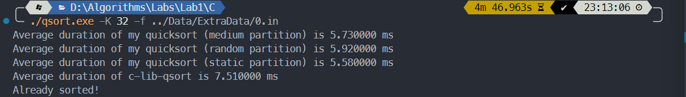
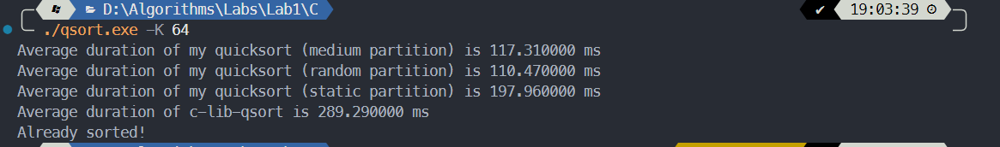
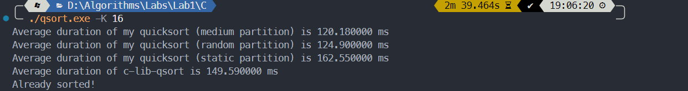

# 算法第一次实验实验报告

> 学号：PB21030794             姓名：王道宇

## 实验内容

编程实现**快速排序**，并且实现**快速排序**的优化。

## 算法思想介绍

> 由于老师要求，快速排序计时结果需要与 C Standard Library 中 qsort 函数对比。然而笔者开始实现快速排序时使用的是C++ 语言编写，所以后来又移植了 C 语言版本。在算法思想介绍阶段使用 C++ 版本介绍，实验结果展示时使用 C 语言版本。

#### 传统快速排序思想的一些问题

- 在传统快速排序中，算法的性能与每次 PARTITION 的分组结果密切相关。但 PARTITION 使用的是固定基准，如果分组不够合理将导致递归调用过深，时间复杂度将达到 $O(n^2)$ ，这是不可接收的。
- 传统快速排序将递归终点定为排序序列的长度为 2 ，然而在序列长度较短时，使用快速排序所带来的性能提升相较于调用递归函数的开销可能是微乎其微的。
- 当需要排序的序列中有大量元素重复时，传统快速排序使用一个元素作为 pivot value 显然是不够合理的。

#### 相较于问题的一系列改进

- 为了找到每次 PARTITION 的最优结果，我们的任务是找到序列中尽量接近中位数的值作为 pivot value。以下是两种方法：

  1. 随机基准法：在每次 PARTITION 时，从序列中随机找到一个数作为 pivot value。这种方式从期望上不会落入最差情况。在具体实现时有一个较为关键的问题：C++ 中取随机数的范围为 0 ~ 65535，无法满足较长序列的要求，所以这里修改传统取随机数的方法：使用标准命名空间中的 random_device 类通过本机硬件设备生成随机种子，并以此初始化 mt19937（ Mersenne Twister 伪随机数生成器）类，检测种子的熵（entropy）来决定使用当前系统时间戳还是随机设备输出作为种子。使用 uniform_real_distribution 类的函数生成指定范围的实随机数，转成整形使用。

     具体代码如下：

     ```cpp
     int Qsort::GetRandom(double Min = 1, double Max = 100000) {
     	static random_device rand_dev;
     	static mt19937 rng(rand_dev.entropy() > 0 ? rand_dev() : time(nullptr));
     	static uniform_real_distribution<double> distrib;
     	return static_cast<int>(
     		distrib(rng, uniform_real_distribution<double>::param_type{Min, Max}));
     }
     
     ```

  2. 多数取中法：取序列中特定位置的部分值排序，取中位数作为 pivot value。这种方法简单直观，并且开销较小，**实验结果中也用了这种方法**。最终结果中，由于选取的其它参数的影响，将取值定为取五个数的中位数。选取位置为序列的三个四等分点以及起始结尾。

- 为了实现尽量少的调用递归函数的开销，选取 K，使得当序列的长度小于 K 时，使用插入排序代替快速排序。结果中也会分析不同 K 对运行时间的影响。

- 在选取 pivot value 时，可以将只选一个值改为选择与该 pivot value 相等的一段区间，这样可以有效减少递归深度。具体实现时，需要维护序列的五个指针，分别是最左的头指针 p 、最右的尾指针 r 、第一个与 pivot value 相等的值的位置 lptr 、最后一个与 pivot value 相等的值的位置 rptr 以及遍历指针 i 。pivot的初始位置在序列的最左，即 p ，lptr 的初始位置在 p，rptr 的初始位置在 r + 1，遍历指针 i 的初始位置在 p 。在遍历过程中，遍历指针右移，当遍历的当前值比 pivot 小时，将 lptr 的后一个位置与当前值互换，并且 lptr 同步右移；当遍历的当前值比 pivot 大时，将 rptr 的前一个位置与当前值互换，将 rptr 左移，但是遍历指针不右移（因为交换过来的值还没有遍历）；当遍历的当前值与 pivot 相等时，将遍历指针右移然而 lptr 不右移。这样，在遍历的过程中 (lptr，i) 的元素均与 pivot 相等。遍历的终止条件是 i >= rptr，表示当前值就是所有与 pivot 相等的元素的下一个了。遍历结束之后，将 lptr 位置的值与序列开始的 pivot 互换，这样 [lptr, rptr) 即为最终所有与 pivot 相等的元素。具体代码如下：

  ```cpp
  pair<int, int> Qsort::Partition(vector<int> &data, int p, int r) {
  	int lptr = p, rptr = r + 1;
  	int i	 = lptr;
  	int pivot = data[p];
  	while (i < rptr) {
  		if (data[i] < pivot) {
  			swap(data[i], data[lptr + 1]);
  			lptr++;
  			i++;
  		} else if (data[i] > pivot) {
  			swap(data[i], data[rptr - 1]);
  			rptr--;
  		} else {
  			i++;
  		}
  	}
  	swap(data[p], data[lptr]);
  	return make_pair(lptr, rptr);
  }
  ```

  返回值为 lptr 与 rptr 的 pair 。

## 实验结果

> 运行环境：Windows 11，Intel Core i7-13700H (Laptop)
>
> 也尝试了本机的 Ubuntu 23.04 Laptop 系统以及挂载在Windows wsl2 下的 Ubuntu 22.04，用于测试时间，结果大致相同，故以Windows 为结果展示。

> 实验仓库为：https://github.com/Melmaphother/2023-Algorithm-Labs  但目前未公开，如果助教需要检查除提交外的内容，可以与我联系 ~~

#### 关于实验结果的约定：

- 为了与 C Standard Library 中的 qsort 函数对比，将算法移植到了 C 上。基本的方法和优化并没有改动。

- 为了避免每次运行结果的浮动，使用 100 次循环，分别测试编写的 QuickSort 函数和 qsort 函数，运行函数之前重新从文件中读入原始数据。

- 为了检测排序结果是否正确，程序内部编写了 Verify 函数，遍历序列检测是否为真。

- 为了避免递归的额外开销，程序编译时使用了 gcc -O1 优化。编译命令为：

  ```bash
  gcc -Wall -O1 qsort_arr.c -o qsort_arr
  ```

- 对于原始 1e5 条数据，探究了 K 对程序运行时间的影响，并且选择了相较而言最优的 K。

- 对于额外的三份数据，也做了运行时间的对比，但没有再探究最合适的 K 值了（感觉没什么必要），使用的是上一条数据对应的 K 值。

- 运行结果的形式：分为三行，第一行是实验中实现的快速排序运行 100 次的平均时间，第二行是使用qsort 运行 100 次的平均时间，第三行是一个 bool 值，为 1 表示排序结果正确，为 0 表示排序结果错误。

#### 实验结果：

- 第一份数据：初始 1e5 条数据

  对每个 K 测试 1 ~ 3 次：

  | K    | running time of my quicksort / ms |
  | ---- | --------------------------------- |
  | 2    | 11.13                             |
  | 8    | 9.47                              |
  | 16   | 9.12                              |
  | 32   | 8.08                              |
  | 48   | 8.92 ~ 9.17                       |
  | 64   | 8.65                              |
  | 92   | 8.61 ~ 9.06                       |
  | 128  | 8.45 ~ 8.69                       |

  可以看到，在 K = 32 时，平均运行时间最短。小于 32 时，平均运行较长，这时插入排序的优势并没有体现；超过 32 之后，运行时间不稳定，猜测是因为计算机缓存命中率的问题，如果插入排序的数据较多，缓存不命中的概率升高，运行时间变长且不够稳定。

  全程多次使用 qsort，平均运行结果大约在 11.69 ~ 12.37 之间，**可见，实验实现的快速排序比 qsort 的结果速度更快！**

  计时结束后，又使用实现的快速排序重新排序并测试了结果是否正确。

  使用中间运行的一次为截图：此时 K 为 48

  

- 第二份数据：1e6 条数据，特征为数据随机，取 K 为 32

  运行结果为：

  

- 第三份数据：1e6 条数据，特征为有大量重复元素

  运行结果为：

  

- 第四份数据：1e6 条数据，特征为序列近似有序

  运行结果为：

  