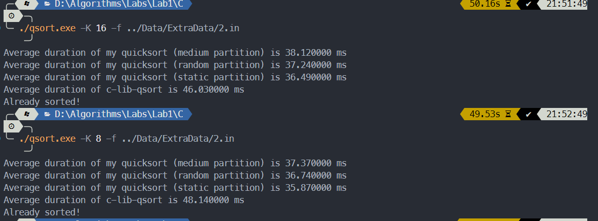
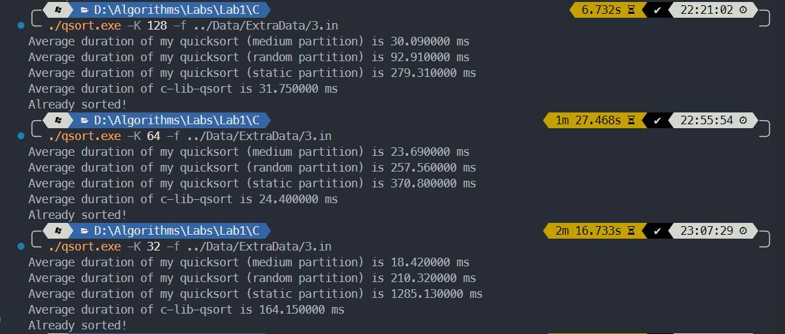

# 算法第一次实验报告

> 学号：PB21030794             姓名：王道宇

## 实验内容

编程实现**快速排序**，并且实现**快速排序**的优化。

## 算法思想介绍

> 由于老师要求，快速排序计时结果需要与 C Standard Library 中 qsort 函数对比。然而笔者开始实现快速排序时使用的是C++ 语言编写，所以后来又移植了 C 语言版本。在算法思想介绍阶段使用 C++ 版本介绍，实验结果展示时使用 C 语言版本。

#### 传统快速排序思想的一些问题

- 在传统快速排序中，算法的性能与每次 PARTITION 的分组结果密切相关。但 PARTITION 使用的是固定基准，如果分组不够合理将导致递归调用过深，时间复杂度将达到 $O(n^2)$ ，这是不可接收的。
- 传统快速排序将递归终点定为排序序列的长度为 2 ，然而在序列长度较短时，使用快速排序所带来的性能提升相较于调用递归函数的开销可能是微乎其微的。
- 当需要排序的序列中有大量元素重复时，传统快速排序使用一个元素作为 pivot value 显然是不够合理的。

#### 相较于问题的一系列改进

- 为了找到每次 PARTITION 的最优结果，我们的任务是找到序列中尽量接近中位数的值作为 pivot value。以下是两种方法：

  1. 随机基准法：在每次 PARTITION 时，从序列中随机找到一个数作为 pivot value。这种方式从期望上不会落入最差情况。
  2. 多数取中法：取序列中特定位置的部分值排序，取中位数作为 pivot value。这种方法简单直观，并且开销较小，**实验结果中也用了这种方法**。最终结果中，由于选取的其它参数的影响，将取值定为取五个数的中位数。选取位置为序列的三个四等分点以及起始结尾。

  **但是实际上，如果序列足够的乱，固定基准也不会比上述两种方式慢。**

- 为了实现尽量少的调用递归函数的开销，选取 K，使得当序列的长度小于 K 时，使用插入排序代替快速排序。结果中也会分析不同 K 对运行时间的影响。

- 在选取 pivot value 时，可以将只选一个值改为选择与该 pivot value 相等的一段区间，这样可以有效减少递归深度。具体实现时，需要维护序列的五个指针，分别是最左的头指针 p 、最右的尾指针 r 、第一个与 pivot value 相等的值的位置 lptr 、最后一个与 pivot value 相等的值的位置 rptr 以及遍历指针 i 。pivot的初始位置在序列的最左，即 p ，lptr 的初始位置在 p，rptr 的初始位置在 r + 1，遍历指针 i 的初始位置在 p 。在遍历过程中，遍历指针右移，当遍历的当前值比 pivot 小时，将 lptr 的后一个位置与当前值互换，并且 lptr 同步右移；当遍历的当前值比 pivot 大时，将 rptr 的前一个位置与当前值互换，将 rptr 左移，但是遍历指针不右移（因为交换过来的值还没有遍历）；当遍历的当前值与 pivot 相等时，将遍历指针右移然而 lptr 不右移。这样，在遍历的过程中 (lptr，i) 的元素均与 pivot 相等。遍历的终止条件是 i >= rptr，表示当前值就是所有与 pivot 相等的元素的下一个了。遍历结束之后，将 lptr 位置的值与序列开始的 pivot 互换，这样 [lptr, rptr) 即为最终所有与 pivot 相等的元素。具体代码如下：

  ```cpp
  pair<int, int> Qsort::Partition(vector<int> &data, int p, int r) {
  	int lptr = p, rptr = r + 1;
  	int i	 = lptr;
  	int pivot = data[p];
  	while (i < rptr) {
  		if (data[i] < pivot) {
  			swap(data[i], data[lptr + 1]);
  			lptr++;
  			i++;
  		} else if (data[i] > pivot) {
  			swap(data[i], data[rptr - 1]);
  			rptr--;
  		} else {
  			i++;
  		}
  	}
  	swap(data[p], data[lptr]);
  	return make_pair(lptr, rptr);
  }
  ```

  返回值为 lptr 与 rptr 的 pair 。

## 实验结果

> 运行环境：Windows 11，Intel Core i7-13700H (Laptop)
>
> 也尝试了本机的 Ubuntu 23.04 Laptop 系统以及挂载在Windows wsl2 下的 Ubuntu 22.04，用于测试时间，结果大致相同，故以Windows 为结果展示。

> 实验仓库为：https://github.com/Melmaphother/2023-Algorithm-Labs  但目前未公开。由于实验报告的篇幅限制，无法将所有截图全部展示，如果助教需要检查除提交外的内容，可以与我联系 ~~

#### 关于实验结果的约定：

- 为了与 C Standard Library 中的 qsort 函数对比，将算法移植到了 C 上。基本的方法和优化并没有改动。

- 为了避免每次运行结果的浮动，使用 100 次循环，分别测试编写的 QuickSort 函数和 qsort 函数，运行函数之前重新从文件中读入原始数据。

- 为了检测排序结果是否正确，程序内部编写了 Verify 函数，遍历序列检测是否为真。

- 为了避免递归的额外开销，程序编译时使用了 gcc -O1 优化。编译命令为：

  ```bash
  gcc -Wall -O1 qsort.c -o qsort
  ```

- 对于原始 1e5 条数据，探究了 K 对程序运行时间的影响，并且选择了相较而言最优的 K。

- 对于额外的三份数据，也做了运行时间的对比，但没有再探究最合适的 K 值了（感觉没什么必要），使用的是上一条数据对应的 K 值。

- 运行结果的形式：分为三行，第一行是实验中实现的快速排序运行 100 次的平均时间，第二行是使用qsort 运行 100 次的平均时间，第三行是一个序列是否已正确排序的信息：使用 Verify 函数，如果已经正确排序，则输出 "Already sorted!"。

#### 如何得到实验结果

实验中使用了多个参数以及其默认值：

- -h：打印帮助信息，并且按照程序设定的默认值运行程序。但是默认值可能跟检查时的数据集文件路径不相同，建议使用下文 -f 参数。
- -f：数据的路径，可以是相对路径或绝对路径
- -o：排序完成之后的保持路径，可以是相对路径或绝对路径
- -K 或 -k：递归程序的终点，也就是何时开始使用插入排序而非递归的快速排序。

一个建议的输入样例：

Windows下：

```bash
./qsort.exe -f 0.in -K 64
```

Linux 下：

```bash
./qsort -f 0.in -K 64
```

#### 实验结果：

- 第一份数据：初始 1e5 条数据

  对每个 K 测试 1 ~ 3 次，时间单位为 ms

  | K And PARTITION | Medium Partition | Random Partition | Static Partition | C Library `qsort` |
  | --------------- | ---------------- | ---------------- | ---------------- | ----------------- |
  | 2               | 7.80 ~ 7.88      | 7.89 ~ 8.27      | 7.52             | 7.78 ~ 7.88       |
  | 8               | 6.51 ~ 6.57      | 6.44 ~ 6.65      | 6.06 ~ 6.13      | 7.45 ~ 7.66       |
  | 16              | 5.95 ~ 5.99      | 5.91 ~ 6.23      | 5.65 ~ 5.84      | 7.30 ~ 7.56       |
  | 32              | 5.62 ~ 5.67      | 5.32 ~ 5.58      | 5.34 ~ 5.52      | 7.33 ~ 7.42       |
  | 48              | 5.46 ~ 5.51      | 5.33 ~ 5.52      | 5.28 ~ 5.36      | 7.37 ~ 7.48       |
  | 64              | 5.36 ~ 5.42      | 5.06 ~ 5.42      | 5.28 ~ 5.33      | 7.26 ~ 7.38       |
  | 96              | 5.32 ~ 5.36      | 5.26 ~ 5.38      | 5.22 ~ 5.29      | 7.33 ~ 7.50       |
  | 128             | 5.32 ~ 5.33      | 5.47 ~ 5.54      | 5.23 ~ 5.41      | 7.10 ~ 7.33       |

  运行截图为：

  

  可以发现，随着 K 增大，在正常范围内，平均运行时间会先呈减小趋势，再慢慢趋于稳定。在这个例子中最短的运行时间应当是 K = 64 时。

  同时可以看到，在数据集较小并且随机性较好时，三种 PARTITION 方法几乎都处在同一时间，并且在取到合适的 K 时可以显著地比 C Library 中的 qsort 快。

  可以发现，RANDOM PARTITION 方式时间跨度较大，稳定性较弱，相比较而言，MEDIUM PARTITION 方式时间跨度较小，稳定性较好。

- 第二份数据：1e6 条数据，特征为数据随机，取 K 为 32

  对每个 K 测试 1 次，时间单位为 ms

  | K And PARTITION | Medium Partition | Random Partition | Static Partition | C Library `qsort` |
  | --------------- | ---------------- | ---------------- | ---------------- | ----------------- |
  | 2               | 151.88           | 151.80           | 131.39           | 140.24            |
  | 8               | 130.77           | 123.14           | 114.51           | 138.39            |
  | 16              | 120.18           | 124.90           | 162.55           | 149.59            |
  | 32              | 137.29           | 239.09           | 242.95           | 379.01            |
  | 64              | 166.11           | 218.13           | 135.92           | 265.34            |
  | 128             | 212.85           | 241.78           | 249.32           | 341.68            |

  以 K = 32 的数据为例，运行截图为：

  

  可以看到，在数据数量较大时，MEDIUM 和 RANDOM 方法在很多情况下要更优于 STATIC 方法，因为分治数据得到了更好的平均。

- 第三份数据：1e6 条数据，特征为有大量重复元素

  对每个 K 测试 1 次，时间单位为 ms

  | K And PARTITION | Medium Partition | Random Partition | Static Partition | C Library `qsort` |
  | --------------- | ---------------- | ---------------- | ---------------- | ----------------- |
  | 2               | 35.69            | 33.88            | 34.72            | 45.28             |
  | 8               | 37.37            | 36.74            | 35.87            | 48.14             |
  | 16              | 38.12            | 37.24            | 36.49            | 46.03             |
  | 32              | 35.34            | 35.71            | 37.45            | 47.54             |
  | 48              | 35.07            | 33.61            | 34.55            | 45.96             |
  | 64              | 36.17            | 33.89            | 34.75            | 45.62             |
  | 128             | 35.55            | 33.22            | 34.93            | 45.52             |

  以 K = 16, 8 的数据为例，运行截图为：

  

  在有大量重复元素的前提下，三种方式都比 qsort 要快，并且幅度较大。

- 第四份数据：1e6 条数据，特征为序列近似有序

  对每个 K 测试 1 次，时间单位为 ms

  | K And PARTITION | Medium Partition | Random Partition | Static Partition | C Library `qsort` |
  | --------------- | ---------------- | ---------------- | ---------------- | ----------------- |
  | 32              | 18.42            | 210.32           | 1285.13          | 164.15            |
  | 64              | 23.69            | 257.56           | 370.80           | 24.40             |
  | 128             | 30.09            | 92.91            | 279.31           | 31.75             |
  
  运行截图为：
  
  
  
  可以看到，在序列近似有序的情况下，STATIC PARTITION 方法将会落入 $O(n^2)$ 的陷阱中，运行时间显著比 MEDIUM PARTITION 方法长。同时，在这种情况下，RANDOM PARTITION 方法只能是中规中矩的水平。