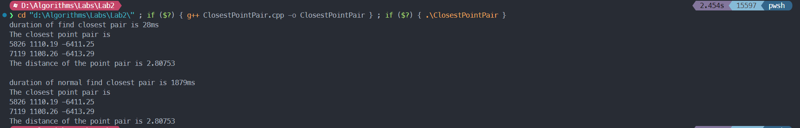

# 算法第二次实验报告

> 姓名： 王道宇       学号： PB21030794

## 实验目标

在给定的 10000 个数据点中利用最邻近点对分治算法求解出最邻近点以及它们之间的距离。

## 算法思想

最邻近点对分治算法的优化过程本质上是将原先暴力搜索算法中 $O({n \choose 2})$ 的时间复杂度一步一步降低。

首先通过分治算法将递推关系式变为 $T(n) = 2T(\frac{n}{2}) + O(nlog(n)) $，再通过数学推导，将递推关系式改为 $T(n) = 2T(\frac{n}{2})+O(n)$。亦即将复杂度从 $T(nlog^2(n))$ 降到 $T(nlog(n))$

优化的核心思想就是预先进行一次预排序，之后在 $O(n)$ 时间内生成已排序的子数组。

这样的结果就是在总的时间复杂度中加上 $O(nlog(n))$，可见对总时间复杂度没有影响。

#### 优化方向

- 数据结构的设计：

  对于点，使用元组记录它的 编号、横坐标、纵坐标，并使用标准命名空间中的 get 函数取元组对应的值；

  对于点对，使用元组记录它的 第一个点、第二个点、距离，并使用标准命名空间中的 get 函数取元组对应的值。

  ```cpp
  typedef tuple<unsigned, double, double> Point;
  typedef tuple<Point, Point, double>		PointPair;
  
  #define serial 0
  #define loc_X 1
  #define loc_Y 2
  
  #define _p1 0
  #define _p2 1
  #define _dist 2
  ```

  获取元组的元素的值就可以用 get<serial>(Point_1) 的方式，较为简便和优雅。

- 类的设计

  在构造函数中使用文件路径作为参数实例化对象，将文件中的数据加载进 vector 中

  类中实现了两种方式求最邻近点，分别是采用分治的最邻近点算法以及暴力搜索法

  类中的私有行为包括预排序、递归、合并（照着书写？），以及调用 sort 函数的自定义比较函数。

- 一些优化

  可以发现，在递归中，按横坐标排序的 vector X 一直不需要变化，而是按纵坐标排序的 vector Y 需要按照对应的横坐标范围需要改变。所以在临时变量的设计上，可以只用 X 的左右两个边界表示当前需要处理的 X 中的范围，而只新创建 vector Y 的临时子序列。这样可以节省栈空间。函数定义如下：

  ```cpp
  /**
   * @brief Recursion
   * 
   * @param Points_X_Sort sorted vector X (still initial X)
   * @param Points_Y_Sort sorted vector Y (slice Y)
   * @param p begin of vector X
   * @param r end of vector X
   * @return PointPair closest PointPair
   */
  PointPair ClosestPair::ClosestPointPair(vector<Point> &Points_X_Sort,
  										vector<Point> &Points_Y_Sort,
  										unsigned p, unsigned r);
  ```

## 实验结果

由于需要与暴力搜索比较，所以同时记录了程序运行时间，按照实验要求输出的结果如下：



可见，两种方式的输出最邻近点对是一样的，而使用分治算法的程序运行时间远远低于暴力搜索法。