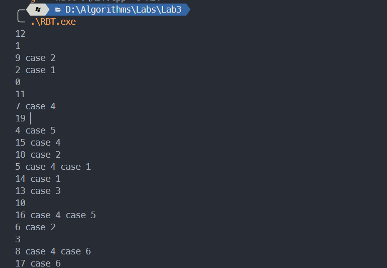
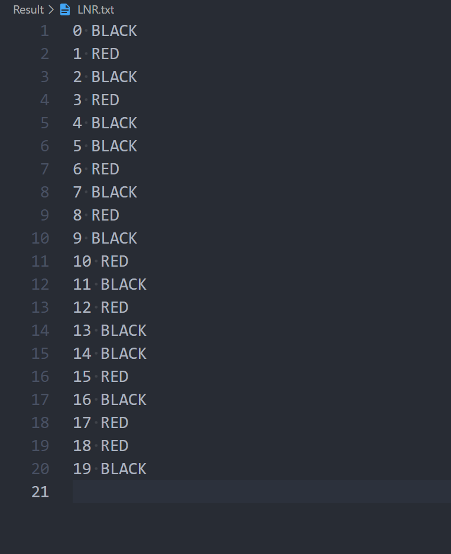
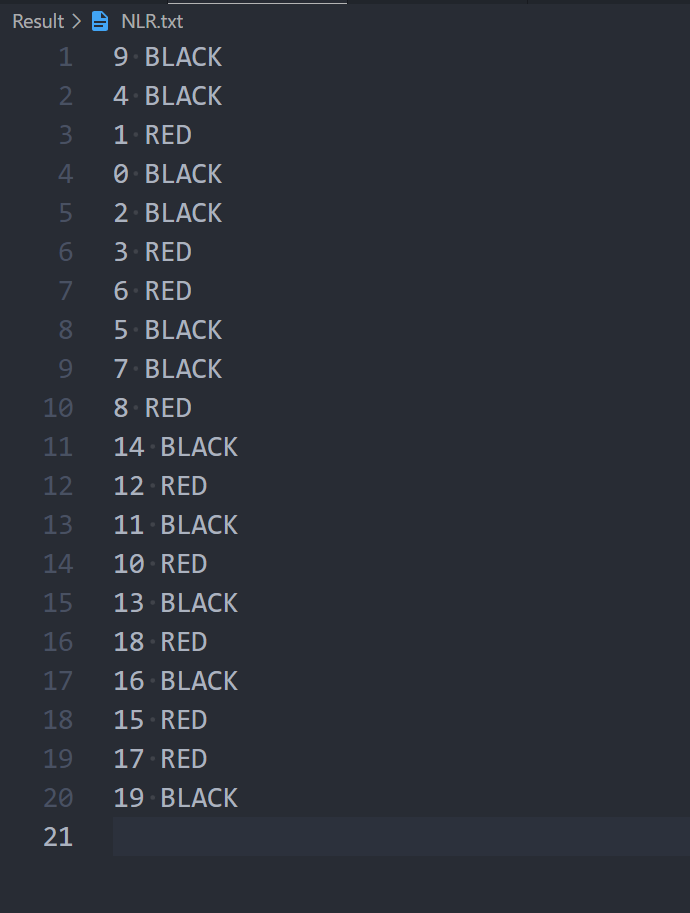
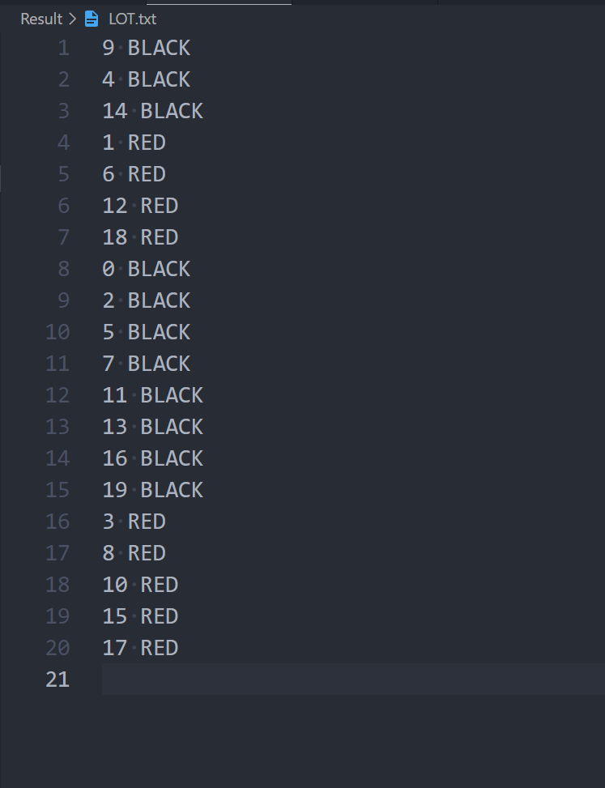

# 算法第三次实验实验报告

> 姓名：王道宇   学号：PB21030794

## 实验内容

实现红黑树的插入算法，并保证红黑树的性质。

按照书本内容，实现类似 LeftRotate，RightRotate，RBInsert，RBInsertFixup 的函数，并在程序的最后使用树的中序遍历、前序遍历以及层序遍历的方式遍历整棵树并写入文件。

## 算法思想设计

1. **数据结构设计**

   - **节点设计**

     一个红黑树的节点应当有以下五个信息：关键字 key、颜色 RED or BLACK、左孩子结点的指针、右孩子结点的指针、父结点的指针。

     树的key有以下两个可能需要考虑的性质：

     - key的类型可能具有多样性，比如key可以是一个整形变量，也可以是**任何可以进行自定义相互比较**的数据类型。
     - key很可能不像整形变量那样只需分配在栈上，如果需要程序手动分配内存，那么如何在程序结束之后释放内存便成为了需要注意的问题。（虽然不管的话操作系统自动帮助释放）

     使用几个技巧解决这些问题：

     - 使用 C++ 中模板的概念，将 key 的类型定义为模板，这样由实例化类时指定类型作为 key 的类型。

     - 重载 < 运算符：使用重载函数自定义 key 之间的大小比较。但是其实重载也不够 oop，因为不能要求调用者再去修改类中重载运算符的函数。更好的方式是仿照 sort 函数，定义比较函数的入口，这样只要求调用者自定义比较函数，实例化红黑树时传入函数指针作为比较依据。

       不过该程序目前只使用了朴素的 < 运算符，因为实验只要求整形数据的相互比较。

     - 考虑到可能需要的释放内存操作，我并没有像 C++ STL 中 set 的红黑树底层实现中使用裸指针作为结点指针的方式，而是使用了 C++11 之后引入的智能指针（smart pointer）的概念，选取 unique_ptr 作为部分结点指针，并选取 C++14 之后引入的 make_unique 函数进行结点指针的初始化。

       考虑到 unique_ptr 的特殊性，一块内存由一个指针管理，它有几个重要的性质：

       - 程序离开指针的作用域时，会自动将指针指向的内容销毁。
       - 传递参数时 unique_ptr 只接受右值引用的方式传递，所以需要使用 std 中的move函数将变量转成右值引用。
       - 由于树错综复杂的结点指向关系，只将左右孩子结点定义为 unique_ptr，而将结点的父指针定义为一个裸指针。因为父指针指向的结点或是 root 结点，或是已经被其他左右孩子结点指针指向的内容，所以父结点指针只起搜索的作用，不允许修改结点的内容。其次，在 Insert 的过程中要进行结点的上溯，所以必须使用裸指针保证上溯时指针的拷贝传递而不是 move。

     最终设计的结点 **结构体** 如下：

     ```cpp
     enum Color { RED, BLANK };
     
     template <typename T> struct RBNode {
     	T	  key;
     	Color color;
     	//* Automatically assigned the initial value 'nullptr'
     	std::unique_ptr<RBNode<T>> left;
     	std::unique_ptr<RBNode<T>> right;
     	RBNode<T>				  *parent; //* it doesn't
     	explicit RBNode(const T &key)
     		: key(key), color(Color::RED), parent(nullptr) {}
     };
     ```

     实际实现还有一些需要的注意点：

     - unique_ptr 定义时会自动初始化为 nullptr，而裸指针不会，所以需要在构造函数中初始化为 nullptr
     - 使用了列表化的构造函数的写法，其中 color 会自动初始化为 RED，对应了 Insert 时将结点置为红的操作。
     - 使用 explicit 保证避免构造函数的隐式类型转换。

   - **树的设计**

     树中有两个关键结点：root 和 nil，然而我认为书本在这个位置有一定的误导性。书本说为了减小存储所需空间，本来所有叶子结点的左右孩子（即 nil 结点）可以合成一个结点 T.nil 。但是在实际实现时，可以考虑以下问题：

     - 如果将 nil 结点视为正常结点，使用上述构造函数构造，那么 nil 结点无法定义父结点，因为所有树的叶子结点都是它的父结点。
     - nil 结点的key值无法定义。

     考虑到我们使用指针去保证树的链接，所以直接使用 nullptr 空指针去代替 nil 结点即可，同时 root  结点由于被声明为 unique_ptr，它也会被初始化为 nullptr ，这是可能会有一个问题：这样无法满足红黑树的性质 2： nil 结点为黑色，因为它只是一个空指针，没有 color 这个属性。然而这个问题也很好解决：当搜索到空指针时，认为该指针指向的 nil 结点即可，如果需要使用 nil 结点的颜色，就认为该空指针 “对应” 了黑色。这种假设在树为空时也是成立的：当树为空时，root 结点也是 nullptr，它的 “颜色” 也刚好为黑（红黑树性质 1：根节点为黑）。

     红黑树类被声明为：

     ```cpp
     template <typename T> class RBTree {
     public:
     	void RBInsert(const T &key);
     	void Display(const string LNR_path, const string NLR_path,
     				 const string LOT_path);
     
     private:
     	void LeftRotate(unique_ptr<RBNode<T>> &&x);
     	void RightRotate(unique_ptr<RBNode<T>> &&x);
     
     private:
     	void RBInsert(unique_ptr<RBNode<T>> &&z);
     	void RBInsertFixup(unique_ptr<RBNode<T>> &&z);
     
     private:
     	unique_ptr<RBNode<T>> root;
     };
     
     ```

     其中重载了 RBInsert 函数，分别代表使用一个 key 插入和使用一个结点的右值引用插入，逻辑是调用者只需要使用 public 的RBInsert(const T &key) 函数即可，程序内部会将其转换为一个结点实体进行插入。

2. **对数据结构的一些补充**

   在介绍完结点和树的数据结构之后可以看到：对于非平凡树而言，所有指针中只有一部分是 unique_ptr，这些指针包括：

   - root 结点
   - 所有非叶子结点的左右孩子

   这也意味着以下结论：

   - 所有叶子结点的左右孩子都是 nullptr
   - 所有非根结点，其所占内存都由其父结点的或是左孩子结点指针，或是右孩子结点指针管理，**其本身没有定义一个裸结点指针管理其内存**。这样做是为了保证 unique_ptr 的指向唯一性，避免多个指针管理（修改）同一块内存，便于unique_ptr 的内存管理。
   - 所有 parent 指针都只有搜索和上溯的作用，不允许裸指针操作内存。

3. **算法设计** 

   分别按照 PPT 中实现左旋、右旋、插入、调整算法即可。不做赘述。

## 实验结果

1. 编译命令：

   ```bash
   g++ -Wall RBT.cpp -o RBT 
   ```

2. 打印结果：

   打印调整算法中的 case：

   

3. 文件输出结果：

   - 中序遍历 LNR

     

   - 前序遍历 NLR

     

   - 层序遍历 LOT

     

     由 LNR 的结果可以看出结果是正确的。

## 困难以及解决

