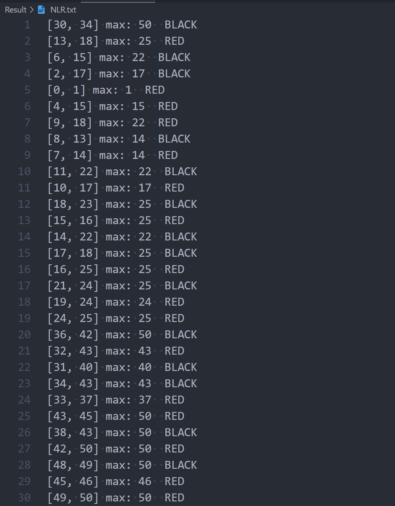
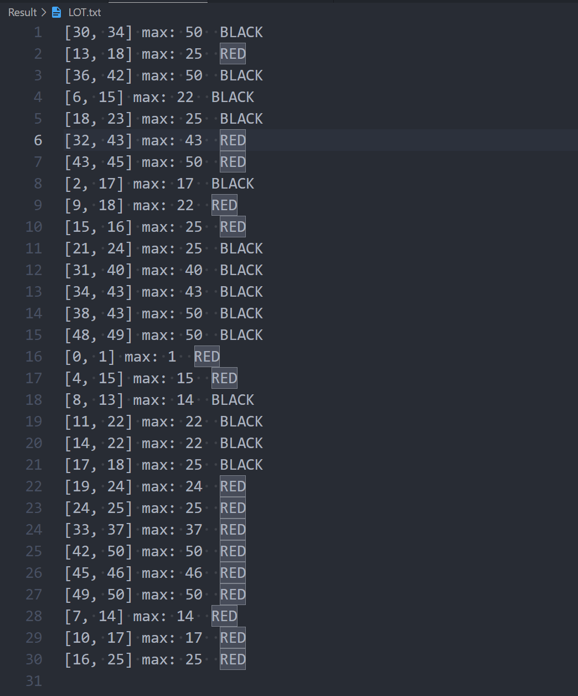
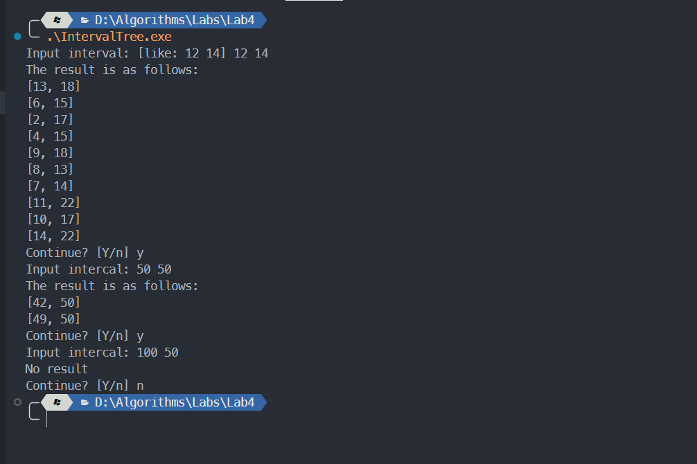

# 算法第四次实验实验报告

> 姓名：王道宇          学号：PB21030794

## 实验内容

实现区间树数据结构的维护，并且在区间树中实现查找功能。

## 算法思想设计

- 区间树相比于红黑树的改进点

  由于我在红黑树中实现了模板，所以对于区间树只需要改变调用者的调用参数即可。

  对于区间树，其结点中需要新建一个域：max，其关键字 key 值是一个区间，它具有上界和下界，基于这种结构，可以使用 pair 来表述这种关键字。具体数据结构如下：

  ```cpp
  typedef std::pair<int, int> Key_Type;
  ```

  对于区间树，还有一个需要注意的点就是：在程序中要维护 max 域的性质：

  ```cpp
  x->max = max(x.high, x->left->max, x->right->max）
  ```

  一共有两处需要维护其性质：

  - 插入结点时遍历一条从根到叶的路径的过程中

    遍历时，遍历的当前结点需要更新其 max 域的值。

    ```cpp
    x->max = max(x->max, z->key.second);
    ```

  - 左旋右旋时

    以左旋为例，需要考虑 x 是否有左子树和右子树，并且需要判断右子树是否有左子树：
    
    ```cpp
    if (x->left) {
    	if (x->right) {
    		if (x->right->left) {
    			x->max = max(x->key.second, x->left->max, x->right->left->max);
    		} else {
    			x->max = max(x->key.second, x->left->max);
    		}
    	} else {
    		x->max = max(x->key.second, x->left->max);
    	}
    } else {
    	if (x->right) {
    		if (x->right->left) {
    			x->max = max(x->key.second, x->right->left->max);
    		} else {
    			x->max = x->key.second;
    		}
    	} else {
    		x->max = x->key.second;
    	}
    }
    if (x->right) { x->right->max = max(x->right->max, x->max); }
    ```
    

- 查找功能的实现

  由于程序要求我们查找出所有与目标区间有重叠的区间，故在遍历完左区间之后需要再次遍历右区间，相当于中序遍历的顺序：

  ```cpp
  template <typename T>
  inline bool RBTree<T>::overlap(const T &x, const T &interval) {
  	return !(x.second < interval.first || interval.second < x.first);
  }
  
  template <typename T>
  void RBTree<T>::IntervalSearch(const RBNode<T> *root, const T &interval,
  							   std::vector<T> &result) {
  	if (overlap(root->key, interval)) { result.push_back(root->key); }
  	if (root->left && root->left->max >= interval.first) {
  		IntervalSearch(root->left.get(), interval, result);
  	}
  	if (root->right && root->right->max >= interval.first) {
  		IntervalSearch(root->right.get(), interval, result);
  	}
  }
  ```

  这里使用 inline 关键字表征内联函数，避免调用函数的额外开销。在 Search 时，使用递归并标定了递归进行的条件。下面分析该算法的复杂度：
  
  该算法最多检查每个节点两次并执行恒定的操作时间检查，因此运行时间不能超过 O(n)。 如果进行递归调用树的一个分支，那么该分支必然包含与需要插叙重叠的区间，所以运行时间也不能超过 O(k log n)，因为高度最多为 n 并且重叠区间数为 k 。

## 实验结果

- 区间树插入结果，仅展示先序遍历和层序遍历的结果：

  - 中序遍历

  

  - 层序遍历

  

- 搜索结果：

  这里展示三种情况：查询区间与红黑树中部分区间重叠；查询区间为一个点；查询区间不符合要求

  