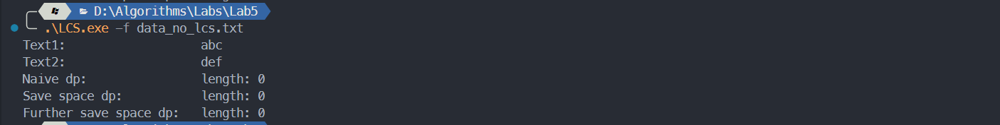

# 算法第五次实验实验报告

> 姓名： 王道宇   学号：PB21030794

## 实验目的

1. 编程实现最长公共子序列（ `LCS` ）算法，并理解其核心思想。

2. 时间复杂度 $O(mn)$，空间复杂度 $O(mn)$，求出 `LCS` 及其长度。
3. 时间复杂度 $O(mn)$，空间复杂度 $O(2*min(m,n))$，求出 `LCS` 的长度。
4. 时间复杂度 $O(mn)$，空间复杂度 $O(min(m,n) + 1)$，求出 `LCS` 的长度。

## 算法思想设计

求最长公共子序列的过程实际上是动态规划的过程。动态规划的状态转移方程为：
$$
dp[i][j] = 
\begin{cases}
dp[i-1][j-1] + 1 ,\quad text1[i-1] = text2[j-1]\\
\max\{dp[i-1][j],dp[i][j-1]\},\quad text1[i-1]\neq text2[j-1]
\end{cases}
$$

1. 为了保证输入的两个字符串长度有顺序之分，在构造函数中规约了两个字符串为较长的在上，较短的在下。

2. 朴素的动态规划算法：

   在朴素的动态规划算法中，我们使用一个大小为 $m\cdot n$ 大小的表保存每个 $dp$ 表项。算法自下而上，自左向右地遍历整个表。

   虽然朴素动态规划算法需要较大地空间保存每个表项，然而，如果需要最大公共子序列的内容，最少也需要 $O(mn)$ 大小的空间用于保存足够的信息，否则在回溯时无法将最大公共子序列的内容记录下来。

   - 遍历过程：

     在遍历中实际上不需要使用书中给出的方法：用另一个表保存箭头指向。因为这个信息在回溯时可以再次将对应位置进行比较来确定回溯的指向。所以在遍历中只需要将表项的内容按照状态转移方程填写完成即可。具体代码如下：

     ```cpp
     	std::vector<std::vector<int>> dp(m + 1, std::vector<int>(n + 1, 0));
     	for (int i = 1; i <= m; i++) {
     		for (int j = 1; j <= n; j++) {
     			if (this->text1[i - 1] == this->text2[j - 1]) {
     				dp[i][j] = dp[i - 1][j - 1] + 1;
     			} else {
     				dp[i][j] = std::max(dp[i - 1][j], dp[i][j - 1]);
     			}
     		}
     	}
     ```

     这里设计了一个二维 $vector$ 作为 $dp$ 表项，同时将其初始化为 0

   - 回溯过程：

     回溯时，从表中最右下角开始，比较对应位置字符串中的字符，如果相等，那么将该字符压入结果字符串中回溯方向为左上的表项；如果不等，那么将表项左边和上边的表项比较，较大的表项即为回溯的方向。具体代码如下：

     ```cpp
     	std::string lcs;
     	int			i = m, j = n;
     	while (i > 0 && j > 0) {
     		if (this->text1[i - 1] == this->text2[j - 1]) {
     			lcs.push_back(this->text1[i - 1]);
     			i--;
     			j--;
     		} else if (dp[i - 1][j] > dp[i][j - 1]) {
     			i--;
     		} else {
     			j--;
     		}
     	}
     ```

     回溯结束后，变量 $lcs$ 中不是最终结果，需要将其反转之后再进行返回，其中返回值是一个 $pair$ ，包括最长子序列和其长度：

     ```cpp
     	std::reverse(lcs.begin(), lcs.end());
     	return std::make_pair(lcs, dp[m][n]);
     ```

3. 缩减空间复杂度至 $O(2*min(m,n))$：

   可以看到，动态转移方程的每一项只与其上一行以及其左边的一个元素有关，所以我们可以只使用两个长为 $min(m,n)$ 的 $vector$ 即可。

   一旦缩减至该空间复杂度，就不可能在有限时间回溯出最大公共序列，所以在此只输出最大公共序列的长度，具体代码如下：

   ```cpp
   	int				 m = this->text1.size();
   	int				 n = this->text2.size();
   	std::vector<int> dp_pre(n + 1, 0), dp_now(n + 1, 0);
   	for (int i = 1; i <= m; i++) {
   		for (int j = 1; j <= n; j++) {
   			if (this->text1[i - 1] == this->text2[j - 1]) {
   				dp_now[j] = dp_pre[j - 1] + 1;
   			} else {
   				dp_now[j] = std::max(dp_pre[j], dp_now[j - 1]);
   			}
   		}
   		/*
   		 * Direct assignment operations between STL composed of
   		 * statically allocated data types are overloaded in c++
   		 */
   		dp_pre = dp_now;
   	}
   	return dp_now[n];
   ```

4. 缩减空间复杂度至 $O(min(m,n) + 1)$：

   可以看到，动态转移方程的每一项只与其上方的、左边的、左上的三个元素有关，所以我们可以只使用一个长为 $min(m,n)$ 的 $vector$ 以及一个额外临时变量 $pre$ 保存左上的一个元素即可。所有修改均为原址改动。具体代码如下：

   ```cpp
   	int				 m = this->text1.size();
   	int				 n = this->text2.size()；
   	std::vector<int> dp_now(n + 1, 0);
   	int				 pre, now;
   	for (int i = 1; i <= m; i++) {
   		pre		  = 0;
   		dp_now[0] = 0; // * not need but for clear
   		for (int j = 1; j <= n; j++) {
   			if (this->text1[i - 1] == this->text2[j - 1]) {
   				now = pre + 1;
   			} else {
   				now = std::max(dp_now[j], dp_now[j - 1]);
   			}
   			pre		  = dp_now[j];
   			dp_now[j] = now;
   		}
   	}
   ```

   

## 实验结果

1. 有公共子序列

   

2. 无公共子序列

   
