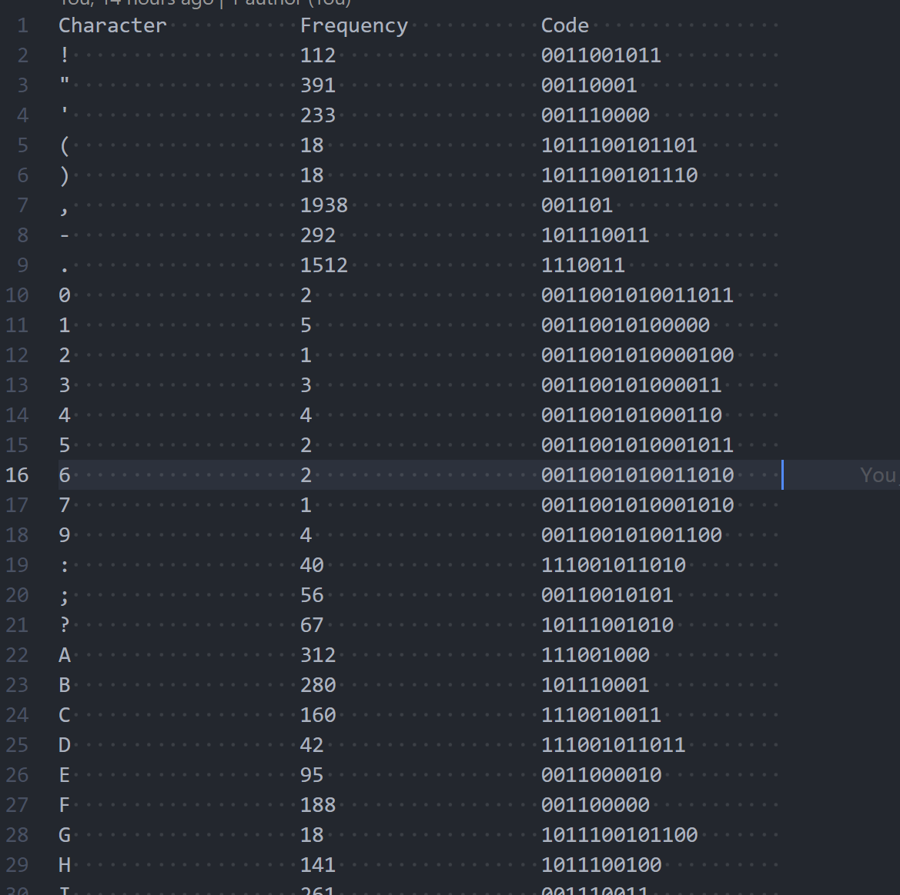
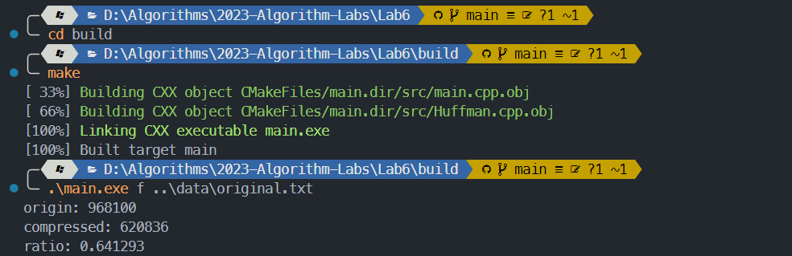

# 算法第六次实验实验报告

> 姓名： 王道宇
>
> 学号： PB21030794

## 实验目的

使用小根堆实现一篇文章出现字符的 Huffman 编码。 

## 算法思想设计

首先介绍两个 C++ 中的 STL： map 和 priority_queue：

1. map

   map内部实现了一个红黑树，该结构具有自动排序的功能，因此map内部的所有元素都是有序的，红黑树的每一个节点都代表着map的一个元素，因此，对于map进行的查找，删除，添加等一系列的操作都相当于是对红黑树进行这样的操作，故红黑树的效率决定了map的效率。

   - 优点

     有序性，这是map结构最大的优点，其元素的有序性在很多应用中都会简化很多的操作红黑树，内部实现一个红黑书使得map的很多操作在 log(n) 的时间复杂度下就可以实现，因此效率非常的高。

   - 缺点

     空间占用率高，因为map内部实现了红黑树，虽然提高了运行效率，但是因为每一个节点都需要额外保存父节点，孩子节点以及红/黑性质，使得每一个节点都占用大量的空间。

2. priority_queue

   priority_queue 定义了一个元素有序排列的队列。默认队列头部的元素优先级最高。因为它是一个队列，所以只能访问第一个元素，这也意味着优先级最高的元素总是第一个被处理。但是如何定义“优先级”完全取决于调用者，比如在程序中为了实现小根堆，重载了 () 运算符：

   ```cpp
   struct compare {
   	//* default is "less", l->freq > r->freq represents the priority of l is
   	//* less than r
   	bool operator()(pHuffmanNode l, pHuffmanNode r) {
   		return (l->freq > r->freq);
   	}
   };
   ```

形成 Huffman 树时，首先从优先队列中 pop 出两个最小值，将其关键字加和之后再重建新结点插入有限队列，这样可以保证优先队列中元素的相对关系。最终剩下的最后一个结点即为 Huffman 树的根节点：

```cpp
while (this->minHeap.size() > 1) {
		auto left = this->minHeap.top();
		this->minHeap.pop();
		auto right = this->minHeap.top();
		this->minHeap.pop();
		auto new_node	= new HuffmanNode('\0', left->freq + right->freq);
		new_node->left	= left;
		new_node->right = right;
		this->minHeap.push(new_node);
	}
	this->root = this->minHeap.top();
```

在形成 Huffman 树之后，可以通过自顶向下的遍历操作将所有 Huffman 结点的编码值求出，并保存在一个 map 中：

```cpp
void HuffmanCode::GenerateCode(pHuffmanNode &root, std::string str) {
	std::string left_str  = str + "0";
	std::string right_str = str + "1";
	if (root->left == nullptr && root->right == nullptr) {
		code[root->character] = str;
		return;
	}
	if (root->left != nullptr) GenerateCode(root->left, left_str);
	if (root->right != nullptr) GenerateCode(root->right, right_str);
}
```

最终通过编码 map 将结果输出到文件即可。

求压缩率时，首先确定文件的定长编码，文件中只需考虑 33 到 126 的字符，所以只需要 7 位定长编码；而 Huffman 编码的长度由词频和 Huffman 编码的长度共同确定。

```cpp
	size_t bits = static_cast<size_t>(std::ceil(std::log2(size)));
	for (const auto &[character, freq] : freq) { origin += freq * bits; }
	for (const auto &[character, str] : code) {
		compressed += freq[character] * str.size();
	}
```

## 实验结果

文件目录如下：

```make
.
├─data
├─report
│  └─assets
└─src
   └─Huffman.cpp
   └─Huffman.h
   └─main.cpp
```

为了正常编译运行程序，请按如下方式操作：

注意本项目需要 –std=c++17 的支持。

在项目根目录执行：

```bash
mkdir build
```

```bash
cd build
```

在 build 文件夹下执行：

Windows：

```bash
cmake .. -G "MinGW Makefiles"
```

```bash
mingw32-make  or  make
```

Linux：

```bash
cmake ..
```

```bash
make
```

生成的可执行文件在 build 文件夹下，直接执行：

```bash
.\main.exe [-f ../data/original.txt] [-o ../data/table.txt]
```

即可。

1. 编码输出文件

   

2. 压缩率

   

