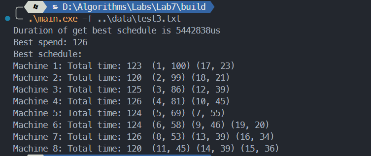
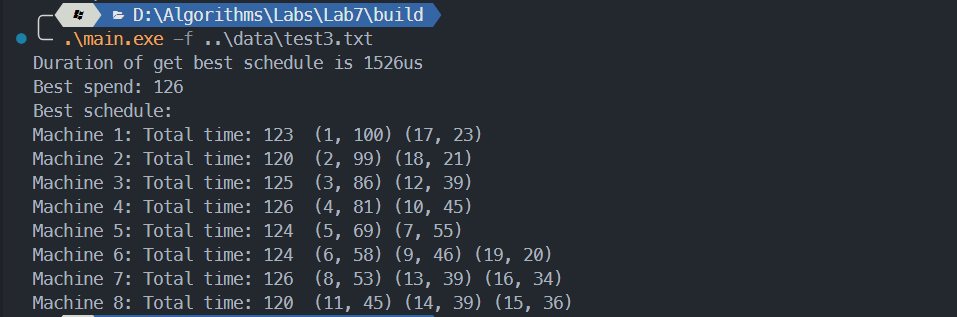
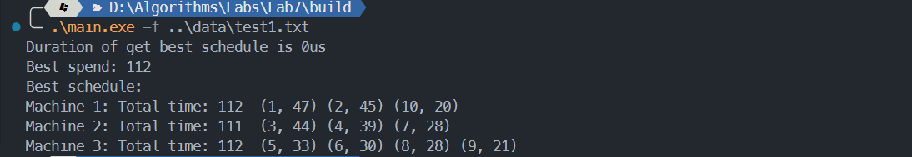
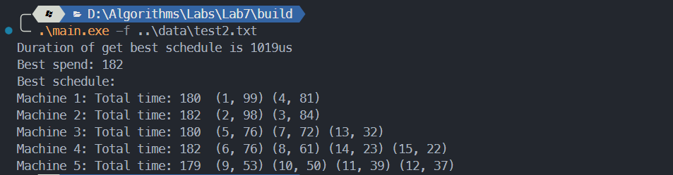

# 算法第七次实验实验报告

> 姓名： 王道宇
>
> 学号： PB21030794

## 实验目的

设有 $n$ 个任务由 $k$ 个可并行工作的机器来完成，完成任务 $i$ 需要时间为 $t_i$ 。试设计一
个算法找出完成这 $n$ 个任务的最佳调度，使完成全部任务的时间最早。（要求给出调度方案）。

在本实验中我们只考虑 $n > k$ 的情况。因为 $n < k$ 时最佳调度方案就是将 $n$ 个任务放在 $n$ 个机器中完成，最短时间为最长任务的时间。  

## 算法思想设计

本题应当使用回溯法来解决，下文将说明为何不能使用贪心法解决。

假设使用贪心法解决，首先将所有给定的任务按需要时间从大到小排序，选取贪心策略为开始将最长时间的 $k$ 个任务放入 $k$ 个机器中，之后始终选取当前最短时间的机器放入接下来的任务。然而这种方式并不一定能得到最优解，比如下例：

任务队列为 $\{16, 14, 12, 11, 10, 9, 8\} $，机器数为 $3$ ，如果使用贪心策略，那么任务安排序列为 $ \{1, 2, 3, 3, 2, 1, 3\}$，这样 $3$ 台机器完成各自任务的时间为 $25, 24, 31$，完成全部任务的最小时间为 $31$ 。然而最佳调度序列应当为 $\{1, 1, 2, 2, 3, 3, 3\}$，这样 $3$ 台机器完成各自任务的时间为 $30, 23, 27$，完成全部任务的最小时间为 $30$ 。

虽然贪心解不是最优解，它的部分思想还是可以沿用至回溯法中，如果使用朴素的回溯法，其时间复杂度来到了 $O(k^n)$ ，而这对于较大的 $n$ 和 $k$ 来说是不可接受的，所以在回溯的过程中需要进行剪枝操作，朴素的剪枝策略如下：

- 维护一个最优花费时间 $best\_spend$ ，初始化为最大整数，当前的花费 $curr\_spend$ 若大于最优花费，则不进行下面的遍历操作。若当前遍历的结果小于最优花费时间，则更新 $besk\_spend$。

朴素的回溯过程如下：

```cpp
void Schedule::BackTrace(unsigned task_index, unsigned curr_spend) {
	if (task_index == num_tasks + 1) {  // 已经回溯完毕
		if (curr_spend < best_spend) {
			best_spend	  = curr_spend;
			best_schedule = curr_schedule;
		}
		return;
	}
	for (auto k = 1; k <= num_machines; k++) {
		if (std::max(curr_spend, machine_time[k] + task_time[task_index]) <
			best_spend) {
			curr_schedule[task_index] = k;
			machine_time[k] += task_time[task_index];
            // 回溯
			auto new_spend = std::max(curr_spend, machine_time[k]);
			BackTrace(task_index + 1, new_spend);
            // 恢复现场
			machine_time[k] -= task_time[task_index];
			curr_schedule[task_index] = 0;
		}
	}
}
```

可以看到，减小时间复杂度的关键就是如何更快的达到剪枝的条件。基于部分贪心法的思想，设计了以下三种优化方案：

1. 贪心解做初始解

   首先我们知道，贪心解虽然不是最优解，但是它**一定不是最坏解**，**甚至不是次坏解**，所以 $best\_spend$ 可以不初始化为最大整数。先进行一遍贪心策略，将贪心解作为 $besk\_spend$ 的初始值，可以让后来的剪枝更快。

2. 预排序

   通过预排序将所有的任务时间从大到小排序，优先分配时间较长的任务，这样可以让机器的总时间更快的到达 $besk\_spend$，剪枝的速度更快。

   以下是求贪心解加预排序的代码：首先进行预排序，再分配前 $k$ 个时间最长的任务，最后将所有的任务按照当前拥有最短时间的机器分配。

   ```cpp
   unsigned Schedule::InitByGreedy() {
   	std::vector<unsigned> greedy_machine_time(num_machines + 1, 0);
   	unsigned			  greedy_spend = INT_MAX;
   	sort(task_time.begin() + 1, task_time.end(), std::greater<int>());
   	for (auto i = 1; i <= num_machines; i++) {
   		greedy_machine_time[i] += task_time[i];
   	}
   	greedy_spend = task_time[0];
   	for (auto i = num_machines + 1; i <= num_tasks; i++) {
   		auto min_index = std::min_element(greedy_machine_time.begin() + 1,
   										  greedy_machine_time.end());
   		*min_index += task_time[i];
   		greedy_spend = std::max(greedy_spend, *min_index);
   	}
   	// std::cout << "Greedy spend: " << greedy_spend << std::endl;
   	return greedy_spend;
   }
   ```

3. 去除重复机器排序

   可以看到，机器之间是没有任何区别的，所以回溯的过程中会遇到分配相同而仅仅是机器排序不同的情况，所以我们定义一个标准，由于我们的任务进行了预排序，所以分配的任务一定是从时间较大的到时间较小的（或相同的）。而让机器第一个进入的任务时间长度不大于其前一个机器的任务时间长度，即可**约束**所有机器的第一个任务一定是按机器的顺序从大到小排列的。这样的简单约束甚至可以让复杂度从 $O(m)$ 降低到 $O(m/k!)$ 。而实现这种约束也很简单，只要对每个机器维护一个值，表示第一个进入机器的任务时间，让该值不大于其前一个机器的该值即可。具体代码如下：

   ```cpp
   	if (machine_time[k] == 0) {
   		if (task_time[task_index] > machine_max_task_time[k - 1]) {
   			break;
   		}
   		machine_max_task_time[k] = task_time[task_index];
   	}
   	... // 回溯过程
       if (machine_time[k] == 0) machine_max_task_time[k] = 0;
   ```

下面以 text3.txt 数据为例（其中 $n = 19$，$k = 8$），通过程序计时来表示各个优化的程度：

1. 不做优化时：

   完全无法运行出结果，因为 $8^{19} \approx 10^{17} $，而这是实际不可接收的。

2. 贪心解做初始解 + 预排序：

   

   使用了约 $5.4s$，是可用水平，然而当 $n$ 和 $k$ 再增大后，该时间也不可接收。

3. 再去除重复机器排序

   

   使用了约 $1.5ms$，可以看到 $\frac{5.4s}{1.5ms} \approx 3600$，提升幅度巨大。

## 实验结果

文件目录如下：

```makefile
.
├─data
├─report
│  └─assets
└─src
   └─Schedule.cpp
   └─Schedule.h
   └─main.cpp
```

为了正常编译运行程序，请按如下方式操作：

注意本项目需要 –std=c++17 的支持。

在项目根目录执行：

```bash
mkdir build
```

```bash
cd build
```

在 build 文件夹下执行：

Windows：

```bash
cmake .. -G "MinGW Makefiles"
```

```bash
mingw32-make  or  make
```

Linux：

```bash
cmake ..
```

```bash
make
```

生成的可执行文件在 build 文件夹下，直接执行：

```bash
.\main.exe [-f ../data/text1.txt]
```

即可。

同时，程序内部使用了计时工具，可以输出得到最佳调度的时间，时间单位为微秒（us）。可以看到所有给定的数据，均可在 2 毫秒以内给出结果，说明优化后的性能较好。

1. text1.txt

   

2. text2.txt

   

3. text3.txt

   