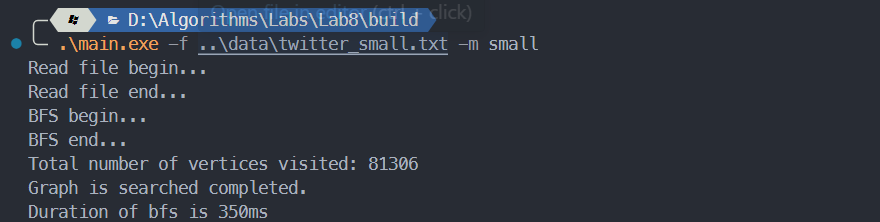
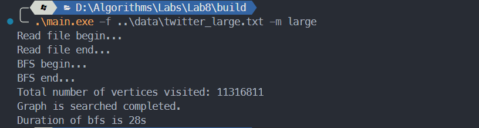

# 算法第八次实验实验报告

> 姓名：  王道宇
>
> 学号：  PB21030794

## 实验目的

1. 针对图，根据给定的数据选择合适的存储方式（邻接矩阵和邻接表中的一种）进行存储
2. 进行图的广度优先遍历（BFS）。

## 算法思想设计

### BFS

经典的连通图 BFS 利用队列，维护是否已经访问过的状态 visited，对图的顶点及其邻接点遍历并不断入队，直到所有的结点均访问完毕。经典的 BFS 伪代码如下：

```cpp
BFS(start){	
	queue q;
    q.push(start);
    visited[start] = 1;
    while(!q.empty()) {
        v = q.front();
        q.pop();
        print(v);
        for(each adjacent vertex 'i' of v){
            if(visited[i] == 0){
                q.push(i);
                visited[i] = 1;
            }
        }
    }
}
```

非连通图的 BFS 仍然需要利用队列，但是此时需要对所有的未访问顶点调用 BFS 。伪代码如下：

```cpp
BFS(){
    for(each vertex of vertices){
        if(visited[i] == 0){
			BFS(i);
        }
	}
}
```

### 存储结构分析

三份数据的特点和结构为：

1. data

   顶点数：9，边数：18，无向连通图

2. twitter_small

   顶点数：81306，边数： 1768149，有向非**强连通图**，有较多重边

3. twitter_large

   顶点数：11316811，边数：85331846，有向非**强连通图**，实际上**无重边**

当图不为稀疏图时，使用邻接矩阵较为方便，可以比较直观地看出顶点间地关系，同时，查看两点之间是否有边相连只需要 O(1) 的复杂度。所以，对于第一份数据，可以直接使用**邻接矩阵**存储。

当图为稀疏图时，比如 twitter_small 和 twitter_large 这两份数据，其 $\frac{E}{V^2}$ 达到了 $2.67\times10^{-4}$ 以及 $6.66\times10^{-7}$ ，那么这两份数据很适合使用**邻接表**存储。

### 复杂度分析

1. 数据结构设计

   在设计邻接表时，使用了如下的数据结构：

   ```cpp
   	std::unordered_map<int, std::unordered_set<int>> adj_list;
   	std::unordered_set<int>							 vertices;
   	std::set<Edge>									 edges;
   	std::unordered_map<int, bool>					 visited;
   	int												 num_vertices;
   	int												 num_edges;
   ```

   - adj_list

     其键为顶点编号，其值为一个无序集合，保存了这个顶点所有邻边的编号。

   - vertices

     直接使用无序集合保存编号即可。

   - edges

     每一条边都由如下的结构体构成：

     ```cpp
     struct Edge {
     public:
     	Edge(int r, int c);
     private:
     	int row;
     	int col;
     };
     ```
     
     由于不知道怎么写 unordered_set 的哈希函数，只能使用 set 作为替代，重载了 set 的 < 运算符，定义了 edge之间的偏序关系如下：
     
     ```cpp
     bool Edge::operator<(const Edge &e) const {
     	return row < e.row || (row == e.row && col < e.col);
     }
     ```
     
     由于 set 在判断两个值（假设为 a，b）是否相等时会调用该函数，调用方式为：若 a < b 或 b < a 均不成立，那么认为 a 与 b 不相等。可见，按照上述的重载函数，两次比较可以排除除了 $a.row = b.row$ 并且 $a.col = b.col$ 的所有情况，换句话说，当插入重边时，set 保证了过滤所有的重边。考虑 edge 的数量在 BFS 时并没有作用，所以最终在读文件和建图时为了**处理速率**并未使用，只保留了其实现如下：
     
     ```cpp
     edges.insert(std::move(Edge(row, col)));
     ```
     
     其中 move 函数将左值转为右值，加快速率并且转移控制权，避免内存堆积。
     
   - visited

     其键为顶点编号，其值为 bool 型变量 true 或 false，代表是否已对该顶点访问过。

   其中 unordered_map 和 unordered_set 均使用 hash 函数，插入删除和查找的时间复杂度均为 $O(1)$。

2. 空间复杂度

   假设顶点数为 n，边数为 m

   - adj_list ：$O(n + m)$
   - vertices：$O(n)$
   - edges：$O(2m)$
   - visited：$O(n)$

   总共空间复杂度为：$O(n + m)$

3. 时间复杂度

   通过摊还分析，对每个顶点调用 BFS 并不会导致最终时间复杂度为顶点数乘 BFS 的时间复杂度，考虑到顶点的 visited 状态会实时更新，所以时间复杂度其实是顶点数加 BFS 的时间复杂度。

   考虑 BFS 的时间复杂度，由于需要遍历一次且仅有一次所有的顶点和边，所以 BFS 的时间复杂度为 $O(m + n)$ 。

   所有最终总的时间度为：$O(m + n)$ 。

## 实验结果

- data

  

- twitter_small

  

- twitter_large

  

最终遍历的顶点数与给定的顶点数相同，说明 BFS 的过程正确。
